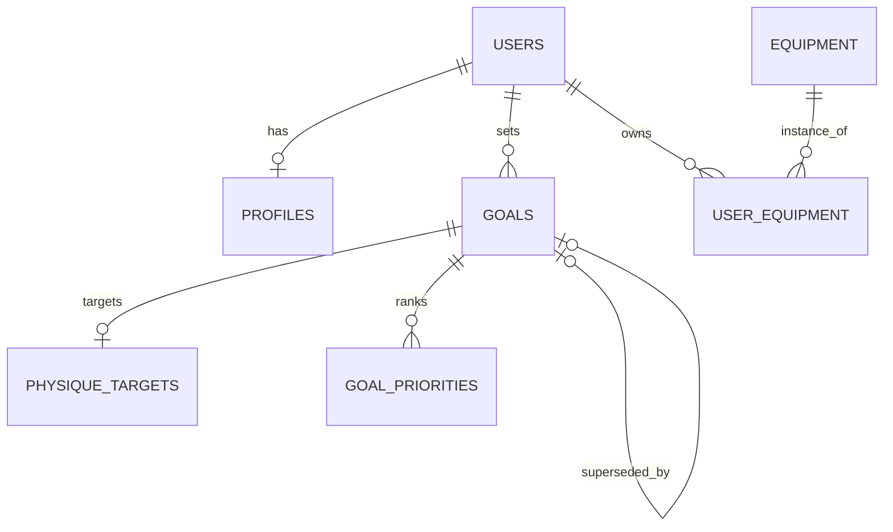
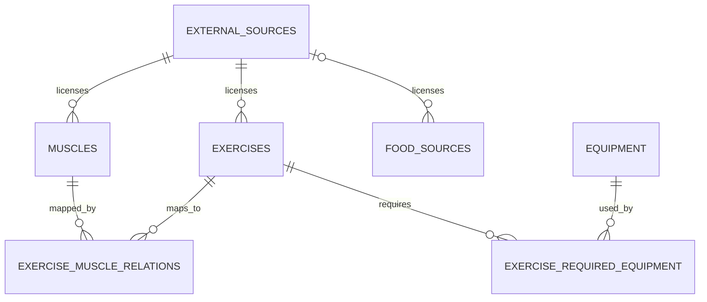
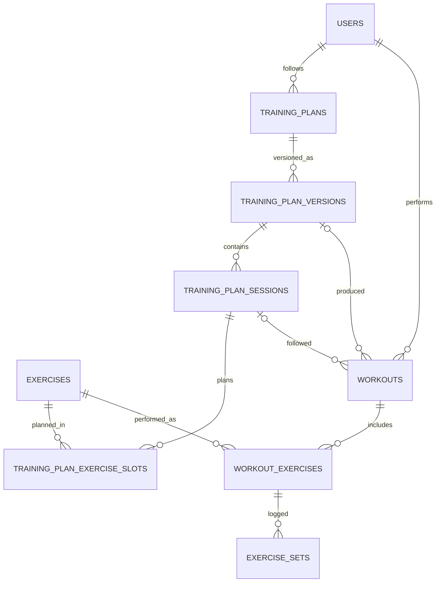
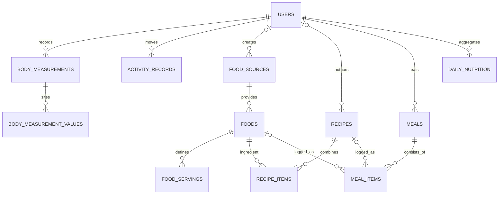
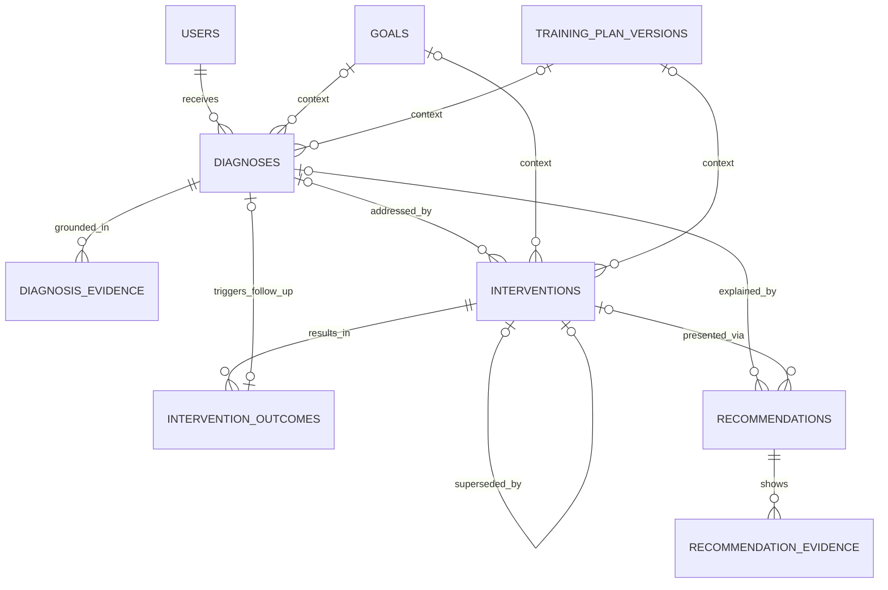

# FitCoach Database Design v0.2

Status: **implemented for Phase 1 and reviewed for V2.** This document started
as a pure design contract; Phase 1 implemented it (PostgreSQL + Prisma, 37
models, migrations, repositories). What actually runs is described in
`docs/DATABASE_IMPLEMENTATION.md`, including divergences D8–D12 from the design
below. Where design and implementation disagree, the implementation doc wins for
"what exists" and this doc remains the "why".

Design date: 2026-08-25 (v0.1), V2 review 2026-10-05.
Inputs: docs/PRODUCT_SPEC.md, docs/ARCHITECTURE.md, packages/domain/src/,
packages/fitness-core/src/, packages/nutrition/src/, packages/ai/src/.

**§23 is the V2 product-requirement review**: for every concept the expanded
product needs, it records whether the current schema already supports it, or
whether it is deliberately deferred to a later phase (with rationale and the
attachment point). Nothing in §23 has been created yet.

---

## 1. Architecture decision

**Choice: relational PostgreSQL as the primary datastore.**

Rationale:

1. **The product is fundamentally historical and relational.** The core loop
   (Measure → Understand → Diagnose → Recommend → Track → Compare → Adjust)
   requires joining observations across time: measurements against meals,
   workouts against goals, interventions against outcomes. This is exactly
   what SQL joins, window functions and constraints are for.
2. **Integrity must be enforced, not hoped for.** Foreign keys, unique
   constraints and CHECK constraints guarantee that a set always belongs to a
   workout, a meal item references exactly one food or recipe, and an active
   goal is unique per user — regardless of which application layer writes.
3. **Deterministic recomputation needs queryable history.** Trend detection,
   muscle coverage and diagnosis all run over user+time windows; indexed
   relational access beats scanning JSON blobs.
4. **JSON is used surgically** (snapshots and kind-specific parameters), so we
   keep schema-on-write discipline while preserving point-in-time facts.
5. **Ecosystem fit.** Mature tooling, type-safe clients, window functions,
   partial/expression indexes (needed for idempotent imports), and operational
   familiarity.

Rejected alternatives: document stores (weak integrity for a highly connected
model), event-sourcing-only stores (unnecessary generality; our immutable
observation tables already give append-only semantics where needed),
flat-file/JSON (the openGym reference approach — insufficient for connected
history, per docs/ARCHITECTURE.md).

## 2. General conventions

These conventions apply to every table below and are stated once:

- **Naming:** snake_case; tables plural; FK columns `<singular>_id`.
- **Primary keys:** `id uuid`. Application-generated **UUIDv7**
  (time-ordered) wherever the client creates rows, so retries can reuse ids
  (idempotency). Server-generated `gen_random_uuid()` is acceptable for
  reference data. (See open questions re: UUIDv7 vs bigint.)
- **Timestamps:** `created_at timestamptz NOT NULL DEFAULT now()`. Mutable
  tables additionally carry `updated_at timestamptz NOT NULL DEFAULT now()`.
  Immutable observation tables deliberately omit `updated_at`.
  All timestamps are UTC; user-local day boundaries are computed with
  `users.timezone` and stored separately as `date` columns.
- **Dates:** `date` (calendar) columns are **user-local days**, never UTC
  derivations at query time.
- **Numbers:** exact `numeric` with explicit precision for all physical
  quantities and nutrition values (no floating-point drift in totals).
  Rounding is performed deterministically in the application.
- **Enums:** `text` + `CHECK (... IN (...))`, mirroring the domain union
  types verbatim. Chosen over native PG enums because adding values to a
  native enum inside a transaction is painful; CHECKs migrate trivially.
- **User data cascade:** every user-owned row has `user_id uuid NOT NULL
  REFERENCES users(id) ON DELETE CASCADE` unless stated otherwise. This is
  the backbone of account erasure (§13).
- **Reference data is never deleted**, only deactivated (`is_active boolean`),
  so historical logs always resolve their references (§5, §13).
- **FK indexes are created explicitly.** PostgreSQL does not auto-index FKs;
  every FK used in joins or cascades gets one.
- **Migrations:** plain versioned SQL files when tooling is chosen; this doc
  does not pick a migration framework.

## 3. Entity relationship overview

The model splits into five clusters (diagrams in §18):

1. **Identity & inventory** — users, profiles, goals (+priorities,
   physique targets), equipment catalog + per-user inventory.
2. **Reference catalog** — external sources, muscles, exercises, relations;
   global, licensed, shared across users, never deleted.
3. **Training** — plans → plan versions → sessions → slots; workouts →
   workout exercises → sets (what was actually done).
4. **Body & nutrition** — measurements, activity records; food sources →
   foods → servings; recipes; meals → items; daily aggregates.
5. **Coaching loop** — diagnoses (+evidence), recommendations (+evidence),
   interventions, intervention outcomes; each linked back to the goal and
   plan version context that was current when it was created.

## 4. Table-by-table proposal

Tables marked **[added]** are normalizations of structures that already exist
in the domain model (or explicit requirements of §11/§10 of this task), not
speculative extras:
external_sources, exercise_required_equipment, food_servings,
training_plan_sessions, training_plan_exercise_slots,
body_measurement_values, diagnosis_evidence, recommendation_evidence.

### 4.1 Identity

#### users

- Purpose: account root; deletion cascades everything personal (§13).
- PK: `id`.
- Fields: `email text NULL`, `display_name text NULL`,
  `external_auth_id text NULL` (reserved for the auth phase),
  `timezone text NOT NULL DEFAULT 'UTC'` (IANA name; defines local-day math).
- Timestamps: created_at, updated_at.
- Constraints: `timezone` non-empty; email format loosely validated.
- Indexes: `UNIQUE (external_auth_id)` partial WHERE not null;
  `UNIQUE (lower(email))` partial WHERE not null.

#### profiles

- Purpose: current personal characteristics used by calculations.
- PK: `user_id` (true 1:1 with users).
- FKs: `user_id → users(id) ON DELETE CASCADE`.
- Fields: `birth_date date NULL`, `sex text NULL` CHECK in domain values,
  `height_cm numeric(5,1) CHECK > 0`, `training_experience text NULL` CHECK,
  `training_days_per_week smallint CHECK BETWEEN 0 AND 7`,
  `session_duration_minutes smallint CHECK > 0`,
  `limitations text[] NOT NULL DEFAULT '{}'`
  (few free-form tags; array is deliberate, see §16 note),
  `unit_system text NOT NULL DEFAULT 'metric'` CHECK.
- Timestamps: created_at, updated_at.
- Historical note: current-state table. What the system *knew* at decision
  time is preserved via snapshots on coaching/daily tables (§5, open
  question Q1).

### 4.2 Goals

#### goals

- Purpose: **immutable, versioned** goal definitions; changing goals creates
  a new row (§6).
- PK: `id`. FKs: `user_id → users CASCADE`;
  `superseded_by_goal_id → goals(id) ON DELETE SET NULL` (nullable self-ref).
- Fields: `kind text NOT NULL` CHECK in domain GoalKind values,
  `description text NULL`, `effective_from date NOT NULL`,
  `effective_until date NULL` (NULL = currently active).
- Timestamps: created_at, updated_at (updated_at changes only when a row is
  superseded/closed; content columns are otherwise frozen by convention).
- Constraints: CHECK `(effective_until IS NULL OR effective_until > effective_from)`.
- Indexes: **partial UNIQUE `(user_id) WHERE effective_until IS NULL`**
  (at most one active goal); `(user_id, effective_from DESC)`.

#### physique_targets

- Purpose: measurement targets belonging to one goal (1 : 0..1).
- PK: `id`. FKs: `goal_id → goals(id) ON DELETE CASCADE` with `UNIQUE`.
- Fields: `body_weight_kg numeric(6,2) CHECK > 0 NULL`, `body_fat_percent
  numeric(4,1) CHECK BETWEEN 0 AND 60 NULL`, `waist_cm`, `chest_cm`,
  `shoulder_circumference_cm`, `arm_cm`, `thigh_cm`, `calf_cm`
  (`numeric(6,1) CHECK > 0`, all nullable), `notes text NULL`.
- Timestamps: created_at only (immutable with its goal).
- Constraints: CHECK that at least one target field IS NOT NULL.

#### goal_priorities

- Purpose: ordered focus tags of a goal (normalizes domain
  `Goal.priorities`).
- PK: `id`. FKs: `goal_id → goals(id) ON DELETE CASCADE`.
- Fields: `position smallint NOT NULL` (0 = most important), `tag text NOT NULL`.
- Timestamps: created_at only.
- Constraints/indexes: `UNIQUE (goal_id, position)`.

### 4.3 Equipment

#### equipment

- Purpose: **global catalog** of equipment types ("barbell", "cable tower").
- PK: `id`. No user FK.
- Fields: `slug text NOT NULL UNIQUE`, `name text NOT NULL`,
  `category text NOT NULL` CHECK in domain EquipmentCategory values,
  `is_active boolean NOT NULL DEFAULT true`.
- Timestamps: created_at, updated_at.

#### user_equipment

- Purpose: what equipment a specific user had, **with validity interval** so
  "equipment at time T" is answerable (core requirement).
- PK: `id`. FKs: `user_id → users CASCADE`;
  `equipment_id → equipment(id) ON DELETE RESTRICT`.
- Fields: `label text NULL` (user's own naming), `specifications jsonb NULL`
  (free-form device specs — genuine JSON case),
  `valid_from date NOT NULL`, `valid_to date NULL` (NULL = still available).
- Timestamps: created_at, updated_at.
- Constraints: CHECK `(valid_to IS NULL OR valid_to > valid_from)`.
- Indexes: `(user_id, valid_from DESC)`;
  `UNIQUE (user_id, equipment_id, valid_from)`.
- Note: replaces the lossy domain `Equipment.available: boolean`; see §19
  divergence D1.

### 4.4 Exercise/muscle catalog

#### external_sources **[added]**

- Purpose: DB counterpart of `data/provenance/THIRD_PARTY.md`: single place
  recording origin + license of third-party datasets. Required by §10/§17.
- PK: `id`. No user data.
- Fields: `slug text NOT NULL UNIQUE`, `name text NOT NULL`,
  `origin_url text NULL`, `license_spdx text NULL`,
  `license_verified boolean NOT NULL DEFAULT false`,
  `registry_ref text NULL` (pointer into THIRD_PARTY.md), `notes text NULL`.
- Timestamps: created_at, updated_at.
- Constraint: CHECK `(license_verified = false OR license_spdx IS NOT NULL)`
  — a source may not be flagged verified without a license id.

#### muscles

- Purpose: canonical muscle list for coverage/volume math.
- PK: `id`. FKs: `external_source_id → external_sources(id) ON DELETE SET NULL`.
- Fields: `slug text NOT NULL UNIQUE`, `name text NOT NULL`,
  `group text NOT NULL` CHECK in MuscleGroup values, `display_name text NULL`,
  `external_id text NULL` (row id in the upstream dataset),
  `is_active boolean NOT NULL DEFAULT true`.
- Timestamps: created_at, updated_at.
- Indexes: `UNIQUE (external_source_id, external_id)` partial WHERE
  external_id IS NOT NULL (traceability + dedupe during dataset sync).

#### exercises

- Purpose: template-level movement catalog (user-independent).
- PK: `id`. FKs: `external_source_id → external_sources(id) ON DELETE SET NULL`.
- Fields: `slug text NOT NULL UNIQUE`, `name text NOT NULL`,
  `aliases text[] NOT NULL DEFAULT '{}'`, `category text NOT NULL` CHECK,
  `movement_pattern text NULL` CHECK, `unilateral boolean NOT NULL DEFAULT false`,
  `instructions text NULL`, `external_id text NULL`,
  `is_active boolean NOT NULL DEFAULT true`.
- Timestamps: created_at, updated_at.
- Indexes: `UNIQUE (external_source_id, external_id)` partial; GIN index on
  `aliases` (search later).

#### exercise_required_equipment **[added]**

- Purpose: normalizes `Exercise.requiredEquipment: EquipmentId[]` ("all
  listed pieces required simultaneously") with real FKs — arrays cannot be
  FK-checked in PostgreSQL.
- PK: composite `(exercise_id, equipment_id)`.
- FKs: `exercise_id → exercises(id) ON DELETE CASCADE`;
  `equipment_id → equipment(id) ON DELETE RESTRICT`.

#### exercise_muscle_relations

- Purpose: role-weighted exercise→muscle mapping feeding coverage/volume.
- PK: composite `(exercise_id, muscle_id, role)`.
- FKs: `exercise_id → exercises CASCADE`; `muscle_id → muscles RESTRICT`.
- Fields: `contribution_weight numeric(4,3) NULL CHECK BETWEEN 0 AND 1`
  (advisory; interpretation owned by fitness-core, not the DB).
- Timestamps: none beyond reference-data conventions (sync-managed).

### 4.5 Training plans (versioned)

#### training_plans

- Purpose: container/current status of a user's plan.
- PK: `id`. FKs: `user_id → users CASCADE`.
- Fields: `name text NOT NULL`, `status text NOT NULL` CHECK
  ('draft'|'active'|'paused'|'retired'), `notes text NULL`.
- Timestamps: created_at, updated_at.
- Constraints/indexes: **partial UNIQUE `(user_id) WHERE status = 'active'`**
  (one active plan per user).

#### training_plan_versions

- Purpose: **immutable content versions** of a plan; workouts point at the
  version that produced them (§7).
- PK: `id`. FKs: `plan_id → training_plans(id) ON DELETE RESTRICT`
  once referenced by workouts (plans of deleted users vanish via user cascade).
- Fields: `version_number integer NOT NULL CHECK >= 1`, `starts_on date`,
  `ends_on date NULL`, `rationale_notes text NULL`
  (why the plan changed — explainability).
- Timestamps: created_at only.
- Constraints/indexes: `UNIQUE (plan_id, version_number)`;
  CHECK `(ends_on IS NULL OR ends_on >= starts_on)`.

#### training_plan_sessions **[added]**

- Purpose: session templates within a version (normalizes
  `TrainingPlan.sessionTemplates`).
- PK: `id`. FKs: `version_id → training_plan_versions(id) ON DELETE CASCADE`.
- Fields: `name text NOT NULL`, `weekday_hint smallint NULL CHECK BETWEEN 0 AND 6`,
  `position smallint NOT NULL`.
- Constraints/indexes: `UNIQUE (version_id, position)`.

#### training_plan_exercise_slots **[added]**

- Purpose: planned exercises per session (normalizes `SessionTemplate.slots`).
- PK: `id`. FKs: `session_id → training_plan_sessions(id) ON DELETE CASCADE`;
  `exercise_id → exercises(id) ON DELETE RESTRICT`.
- Fields: `target_sets smallint CHECK > 0`, `rep_min smallint NULL`,
  `rep_max smallint NULL`, CHECK `(rep_min IS NULL OR rep_max IS NULL OR
  rep_min <= rep_max)`, `target_rir numeric(3,1) CHECK BETWEEN 0 AND 10 NULL`,
  `rest_seconds integer NULL`, `position smallint NOT NULL`,
  `substitution_exercise_ids uuid[] NULL` — pragmatic array; FKs cannot be
  enforced on elements (documented tradeoff, low-risk: substitutions are
  suggestions, see §19 D5), `notes text NULL`.
- Constraints/indexes: `UNIQUE (session_id, position)`.

### 4.6 Workouts (events)

#### workouts

- Purpose: a training session that happened (or was planned/skipped).
- PK: `id`. FKs: `user_id → users CASCADE`;
  `plan_id → training_plans(id) SET NULL NULL`;
  `plan_version_id → training_plan_versions(id) RESTRICT` (**which version
  produced this workout**);
  `plan_session_id → training_plan_sessions(id) SET NULL NULL`.
- Fields: `title text NULL`, `status text NOT NULL` CHECK
  ('planned'|'in_progress'|'completed'|'partial'|'skipped'),
  `started_at timestamptz NOT NULL`, `ended_at timestamptz NULL`,
  `notes text NULL`, `client_request_id text NULL` (idempotency, §15).
- Timestamps: created_at (= first logged), updated_at.
- Constraints: CHECK `(ended_at IS NULL OR ended_at > started_at)`.
- Indexes: `(user_id, started_at DESC)`; `(plan_version_id)`;
  `UNIQUE (user_id, client_request_id)` partial WHERE client_request_id IS
  NOT NULL; partial `(user_id) WHERE status IN ('planned','in_progress')`.

#### workout_exercises **[added grouping table]**

- Purpose: groups a workout's sets per exercise with order and block-level
  notes (normalizes the implicit grouping inside `Workout.sets`).
- PK: `id`. FKs: `workout_id → workouts(id) ON DELETE CASCADE`;
  `exercise_id → exercises(id) ON DELETE RESTRICT`.
- Fields: `position integer NOT NULL`, `notes text NULL`.
- Timestamps: created_at, updated_at.
- Constraints/indexes: `UNIQUE (workout_id, position)`; `(exercise_id)`
  (powers cross-workout exercise history).

#### exercise_sets

- Purpose: the atomic performance observation (load/reps/RIR/RPE...).
- PK: `id`. FKs: `workout_exercise_id → workout_exercises(id) ON DELETE CASCADE`.
- Fields: `position integer NOT NULL`, `kind text NOT NULL` CHECK
  ('warmup'|'working'|'drop_set'|'rest_pause'|'amrap'|'failure'),
  `load_kg numeric(7,2) NULL CHECK >= 0` (NULL = bodyweight movement),
  `added_load_kg numeric(7,2) NULL CHECK >= 0` (weight added to bodyweight),
  `reps smallint NULL CHECK BETWEEN 0 AND 1000`,
  `distance_meters numeric(8,2) NULL CHECK >= 0`,
  `duration_seconds integer NULL CHECK >= 0`,
  `rir numeric(3,1) NULL CHECK BETWEEN 0 AND 10`,
  `rpe numeric(3,1) NULL CHECK BETWEEN 0 AND 10`,
  `notes text NULL`.
- Timestamps: created_at, updated_at (editable until workout completion;
  policy in §13/open question Q3).
- Constraints: CHECK that a set has at least one measurable
  `(reps OR distance_meters OR duration_seconds) IS NOT NULL`.
- Indexes: `(workout_exercise_id, position)`. Progression queries reach sets
  via `workout_exercises(exercise_id)` joined to `workouts.started_at`.

### 4.7 Body & activity (immutable observations)

#### body_measurements

- Purpose: point-in-time body observation (§9 provenance requirements).
- PK: `id`. FKs: `user_id → users CASCADE`.
- Fields: `recorded_at timestamptz NOT NULL` (when measured),
  `condition text NULL` CHECK (morning_fasted|post_workout|evening|random|other),
  `body_weight_kg numeric(6,2) NULL CHECK > 0`,
  `body_fat_percent numeric(4,1) NULL CHECK BETWEEN 0 AND 60`,
  `entered_via text NULL` CHECK (manual|smart_scale_import|wearable_import|other),
  `confidence text NULL` CHECK (measured|estimated|unknown),
  `source_name text NULL` (device/app label), `external_id text NULL`
  (provider event id, §15), `photo_refs text[] NULL` (**object-storage keys
  only — binaries never in the DB**, §16), `notes text NULL`.
- Timestamps: created_at only (recording time may precede logging time;
  both preserved). Immutable — corrections add new rows.
- Constraints: CHECK that at least one measurement datum exists
  (weight, fat%, or ≥1 circumference row).
- Indexes: `(user_id, recorded_at DESC)` — the primary trend index;
  `UNIQUE (user_id, entered_via, external_id)` partial WHERE
  `COALESCE(external_id, '') <> ''` (import dedupe).

#### body_measurement_values **[added]**

- Purpose: normalized circumferences per site (matches domain
  `Partial<Record<BodySite, number>>`); avoids 11 sparse columns and allows
  site vocabulary growth without DDL.
- PK: composite `(measurement_id, site)`.
- FKs: `measurement_id → body_measurements(id) ON DELETE CASCADE`.
- Fields: `site text NOT NULL` CHECK in BodySite values,
  `value_cm numeric(6,1) NOT NULL CHECK > 0`.
- Indexes: `(site)` INCLUDE (`value_cm`) — waist/chest trend scans join
  efficiently through the parent's `(user_id, recorded_at)` index.

#### activity_records

- Purpose: daily steps aggregate + discrete activity sessions.
- PK: `id`. FKs: `user_id → users CASCADE`.
- Fields: `date date NOT NULL` (user-local), `kind text NOT NULL` CHECK
  ('steps' | walk|run|cycle|row|swim|elliptical|stairs|sport|other),
  `steps integer NULL CHECK >= 0`, `duration_minutes integer NULL`,
  `distance_km numeric(7,3) NULL CHECK >= 0`,
  `average_heart_rate_bpm smallint NULL CHECK BETWEEN 20 AND 260`,
  `estimated_calories_burned numeric(7,2) NULL CHECK >= 0`,
  `effort text NULL` CHECK (low|moderate|high),
  `recorded_via text NULL`, `external_id text NULL`, `notes text NULL`.
- Timestamps: created_at only. Immutable append.
- Constraints: `CHECK (kind <> 'steps' OR steps IS NOT NULL)` and
  `CHECK (kind = 'steps' OR steps IS NULL)` — steps live only on step rows.
- Indexes: `(user_id, date DESC)`; `(user_id, kind, date DESC)`;
  **partial UNIQUE `(user_id, date, recorded_via) WHERE kind = 'steps'`**
  (one cumulative steps value per source/day → idempotent upsert, §15).

### 4.8 Nutrition

#### food_sources

- Purpose: origin + default trust level of food data.
- PK: `id`. FKs: `owner_user_id → users(id) ON DELETE CASCADE NULL`
  (user-created sources); `external_source_id → external_sources(id) SET NULL`.
- Fields: `name text NOT NULL`, `kind text NOT NULL` CHECK
  ('curated_database'|'user_created'|'imported'|'estimate'),
  `default_confidence text NOT NULL` CHECK (measured|label_declared|estimated|unknown).
- Timestamps: created_at, updated_at.
- Constraints: CHECK `(kind <> 'user_created' OR owner_user_id IS NOT NULL)`.

#### foods

- Purpose: canonical food with nutrient density per 100 g/ml.
- PK: `id`. FKs: `source_id → food_sources(id) ON DELETE RESTRICT`;
  `default_serving_id → food_servings(id) SET NULL NULL`.
- Fields: `name text NOT NULL`, `brand text NULL`,
  `density_basis text NOT NULL` CHECK ('per_100g'|'per_100ml'),
  nutrient density columns NUMERIC CHECK >= 0 — `calories_kcal`,
  `protein_g`, `carbohydrate_g`, `fat_g` NOT NULL; `fiber_g`, `sugars_g`,
  `saturated_fat_g`, `alcohol_g`, `sodium_mg` NULL,
  `barcode text NULL`, `external_id text NULL`, `is_active boolean NOT NULL DEFAULT true`
  (retire, never delete — history depends on it).
- Timestamps: created_at, updated_at.
- Indexes: `(source_id)`; `UNIQUE (source_id, external_id)` partial;
  `UNIQUE (barcode)` partial WHERE barcode IS NOT NULL (scan dedupe).

#### food_servings **[added]**

- Purpose: normalizes `Food.servings: ServingDefinition[]`.
- PK: `id`. FKs: `food_id → foods(id) ON DELETE CASCADE`.
- Fields: `label text NOT NULL`, `grams numeric(8,2) CHECK > 0 NULL`,
  `milliliters numeric(8,2) CHECK > 0 NULL`,
  `unit_quantity numeric(8,2) NULL`, `unit_name text NULL`.
- Constraints: CHECK exactly one basis is present:
  `(num_nonnulls(grams, milliliters) = 1 AND unit_quantity IS NULL)
   OR (unit_quantity IS NOT NULL AND unit_name IS NOT NULL
       AND grams IS NULL AND milliliters IS NULL)`;
  `UNIQUE (food_id, label)`.

#### recipes

- Purpose: reusable food compositions.
- PK: `id`. FKs: `owner_user_id → users CASCADE NULL` (NULL = global/shared).
- Fields: `name text NOT NULL`, `servings integer NOT NULL CHECK > 0`
  (portions the item quantities produce), `instructions text NULL`.
- Timestamps: created_at, updated_at.

#### recipe_items

- Purpose: food quantities composing a recipe.
- PK: `id`. FKs: `recipe_id → recipes CASCADE`;
  `food_id → foods RESTRICT`.
- Fields: `quantity_grams numeric(9,2) NOT NULL CHECK > 0`,
  `position integer NOT NULL`, `notes text NULL`.
- Constraints/indexes: `UNIQUE (recipe_id, position)`.

#### meals

- Purpose: a logged eating occasion, **with nutrition snapshot** (§8).
- PK: `id`. FKs: `user_id → users CASCADE`.
- Fields: `local_date date NOT NULL`, `consumed_at timestamptz NULL`,
  `slot text NULL` CHECK (breakfast|lunch|dinner|snack|other),
  totals snapshot columns NOT NULL CHECK >= 0: `total_calories_kcal`,
  `total_protein_g`, `total_carbohydrate_g`, `total_fat_g`, plus optional
  `total_fiber_g`, `notes text NULL`, `client_request_id text NULL`.
- Timestamps: created_at, updated_at (items editable → totals refreshable).
- Indexes: `(user_id, local_date DESC)`;
  `UNIQUE (user_id, client_request_id)` partial WHERE client_request_id IS
  NOT NULL (retry-safe meal logging).

#### meal_items

- Purpose: one consumed line of a meal, with snapshotted nutrients.
- PK: `id`. FKs: `meal_id → meals CASCADE`; `food_id → foods RESTRICT NULL`;
  `recipe_id → recipes RESTRICT NULL`.
- Fields: `quantity_grams numeric(9,2) NULL CHECK > 0` (food path),
  `recipe_servings numeric(6,2) NULL CHECK > 0` (recipe path),
  snapshot nutrients NOT NULL CHECK >= 0 (`calories_kcal`, `protein_g`,
  `carbohydrate_g`, `fat_g`, optional `fiber_g`),
  `confidence text NOT NULL` CHECK (measured|label_declared|estimated|unknown),
  `notes text NULL`.
- Constraints: polymorphic ref as two nullable FKs + CHECK:
  ```sql
  CHECK (
    (food_id IS NOT NULL AND recipe_id IS NULL
       AND quantity_grams IS NOT NULL AND recipe_servings IS NULL)
    OR
    (recipe_id IS NOT NULL AND food_id IS NULL
       AND recipe_servings IS NOT NULL AND quantity_grams IS NULL)
  )
  ```
- Timestamps: created_at, updated_at.
- Indexes: `(meal_id)`.

#### daily_nutrition

- Purpose: per-user-day aggregate snapshot + targets actually applied that
  day (answers "what targets did the system use then?").
- PK: `id`. FKs: `user_id → users CASCADE`.
- Fields: `local_date date NOT NULL`, totals snapshot columns NOT NULL
  (same shape as meals), `targets_snapshot jsonb NULL` — justified JSON:
  frozen copy of domain `NutritionTargets` incl. `basis_note` (§5 S3).
- Timestamps: created_at, updated_at.
- Constraints/indexes: **`UNIQUE (user_id, local_date)`**;
  `(user_id, local_date DESC)`.
- Invariant: fully recomputable from `meal_items` (deterministic; maintained
  by the application via upsert, §15). The stored copy exists so dashboards
  and audits do not depend on recompute-at-read.

### 4.9 Coaching loop

#### diagnoses

- Purpose: a deterministic problem statement grounded in evidence (§11).
- PK: `id`. FKs: `user_id → users CASCADE`;
  `active_goal_id → goals(id) RESTRICT NULL` (context: which goal was active);
  `active_plan_version_id → training_plan_versions(id) RESTRICT NULL`.
- Fields: `code text NOT NULL` (stable machine code), `title text NOT NULL`,
  `summary text NOT NULL`, `severity text NOT NULL` CHECK
  (informational|watch|act|urgent), `status text NOT NULL` CHECK
  (open|monitoring|resolved|dismissed), `analysis_window_days integer NULL`,
  `context_snapshot jsonb NULL` — justified JSON: what the system knew
  (profile facts, trend numbers, target values at analysis time, §5 S3),
  `resolved_at timestamptz NULL`.
- Timestamps: created_at, updated_at.
- Indexes: `(user_id, created_at DESC)`; `(code)`;
  partial `(user_id) WHERE status IN ('open','monitoring')`.

#### diagnosis_evidence **[added]**

- Purpose: normalizes `Diagnosis.evidence: Evidence[]`; makes the support for
  every conclusion queryable (requirement §11).
- PK: `id`. FKs: `diagnosis_id → diagnoses(id) ON DELETE CASCADE`.
- Fields: `metric text NOT NULL`, `window text NOT NULL` (e.g. 'last_14_days'),
  `observed text NOT NULL` (human-readable), `observed_numeric numeric NULL`
  (queryable companion when the observation is a number),
  `expected text NULL`, `position integer NOT NULL`.
- Timestamps: created_at only. Immutable.
- Indexes: `(diagnosis_id)`; `(metric)` (cross-user metric analytics later).

#### recommendations

- Purpose: what the system told the user, when, and why (§11).
- PK: `id`. FKs: `user_id → users CASCADE`;
  `diagnosis_id → diagnoses(id) RESTRICT NULL`;
  `intervention_id → interventions(id) RESTRICT NULL`.
- Fields: `headline text NOT NULL`, `explanation text NOT NULL`,
  `alternatives_considered text[] NULL`, `presented_at timestamptz NOT NULL
  DEFAULT now()`, `status text NOT NULL` CHECK
  (presented|acknowledged|acted_on|dismissed|expired),
  `acknowledged_at timestamptz NULL`, `dismissed_at timestamptz NULL`.
- Timestamps: created_at, updated_at.
- Indexes: `(user_id, presented_at DESC)`; `(diagnosis_id)`.

#### recommendation_evidence **[added]**

- Purpose: the evidence **as presented to the user** — intentionally a copy,
  so later changes to diagnosis evidence never rewrite what the user saw.
- PK: `id`. FKs: `recommendation_id → recommendations(id) ON DELETE CASCADE`.
- Fields: same shape as diagnosis_evidence (`metric`, `window`, `observed`,
  `observed_numeric NULL`, `expected NULL`, `position`).
- Timestamps: created_at only. Indexes: `(recommendation_id)`.

#### interventions

- Purpose: the action taken (or deliberately: no action) to address a
  diagnosis (§12).
- PK: `id`. FKs: `user_id → users CASCADE`;
  `diagnosis_id → diagnoses(id) RESTRICT NULL`;
  `superseded_by_intervention_id → interventions(id) SET NULL NULL` (self-ref);
  `active_goal_id → goals(id) RESTRICT NULL`;
  `active_plan_version_id → training_plan_versions(id) RESTRICT NULL`.
- Fields: `kind text NOT NULL` CHECK in InterventionKind values
  (includes `'no_change'` — §12), `parameters jsonb NOT NULL DEFAULT '{}'`
  (kind-specific structured params; genuine JSON exception — validated by
  the application per kind, §12),
  `rationale text NOT NULL`, `expected_effect text NOT NULL`,
  `review_on date NULL`, `status text NOT NULL` CHECK
  (proposed|accepted|active|completed|rejected|superseded),
  `accepted_at timestamptz NULL`, `completed_at timestamptz NULL`.
- Timestamps: created_at, updated_at.
- Indexes: `(user_id, created_at DESC)`; `(diagnosis_id)`;
  partial `(user_id) WHERE status = 'active'`.

#### intervention_outcomes

- Purpose: the observed result after the review window; closes the adaptive
  loop (did it work?) (§12).
- PK: `id`. FKs: `intervention_id → interventions(id) RESTRICT`;
  `follow_up_diagnosis_id → diagnoses(id) SET NULL NULL`.
- Fields: `evaluated_at timestamptz NOT NULL`, `evaluation_window text NOT NULL`
  (e.g. '14d_post'), `verdict text NOT NULL` CHECK
  (improved_as_expected|no_effect|worsened|uncertain|too_early),
  `observations text[] NOT NULL DEFAULT '{}'`, `explanation text NOT NULL`.
- Timestamps: created_at only. Immutable; re-evaluation adds a new row.
- Constraints/indexes: `UNIQUE (intervention_id, evaluation_window)`;
  `(intervention_id)`; `(follow_up_diagnosis_id)`.

## 5. Historical strategy

Classification:

**Immutable observations / events (append-only):**
body_measurements (+values), activity_records, workouts (content; status
transitions allowed), workout_exercises, exercise_sets (editable only until
their workout completes — then frozen), meals, meal_items (snapshotted
nutrients), diagnoses, diagnosis_evidence, recommendations,
recommendation_evidence, interventions (content; status transitions allowed),
intervention_outcomes, goals (versioned, never mutated), physique_targets,
goal_priorities, training_plan_versions (+sessions/slots).

**Current state (mutable, history lives elsewhere):**
users, profiles, training_plans (container/status), equipment (catalog),
foods/food_servings/recipes content (see snapshot rule below),
user_equipment validity windows (past intervals remain as closed rows).

**Snapshot patterns (how "current state" edits never destroy history):**

- **S1 – Reference data is retired, not rewritten silently:** foods/exercises/
  muscles carry `is_active` and `updated_at`; edits to nutrient densities are
  permitted but every consumer-facing calculation that must stay stable uses
  snapshots (S2/S3).
- **S2 – Value snapshots at write time:** meal_items store computed nutrients
  and confidence; meals store totals. Later food-database edits cannot change
  yesterday's logged meal (§8).
- **S3 – Context snapshots at decision time:** daily_nutrition.targets_snapshot;
  diagnoses/interventions store `active_goal_id`, `active_plan_version_id`
  and a `context_snapshot` JSONB of the inputs used. Recommendations copy
  their evidence into recommendation_evidence. Result: "What did the system
  know when the recommendation was made?" is answerable without replaying
  computation.

Mapping of the required historical questions to the schema:

| Question | Answered from |
|---|---|
| weight/waist on date X | body_measurements(+values) WHERE recorded_at ≤ X ORDER BY recorded_at DESC LIMIT 1 |
| weight/measurement trend | series over (user_id, recorded_at) |
| what they trained / sets/load/RIR | workouts ⋈ workout_exercises ⋈ exercise_sets |
| muscles exposed | sets ⋈ exercise_muscle_relations (fitness-core computes) |
| equipment at time T | user_equipment WHERE valid_from ≤ T < coalesce(valid_to, ∞) |
| what they ate / macros | meals ⋈ meal_items (snapshots) |
| steps/cardio | activity_records (user_id, date) |
| active goal/targets at T | goals WHERE effective_from ≤ T < coalesce(effective_until, ∞) + physique_targets |
| recommendation + evidence | recommendations ⋈ recommendation_evidence |
| intervention + outcome + success | interventions ⋈ intervention_outcomes.verdict |
| what the system knew then | context_snapshot + *_snapshot columns + FK'd goal/plan_version |

## 6. Goal versioning

Goals are **immutable definitions with validity intervals**. Creating a new
goal = INSERT a new row with `effective_from`; the previous active row gets
`effective_until = <new.effective_from>` and `superseded_by_goal_id` set. A
partial unique index guarantees at most one open-ended (active) goal per
user. Diagnoses and interventions store `active_goal_id` **plus** a context
snapshot, so reconstruction works even if goal metadata were ever corrected.

Example timeline: goal A (2026-01-01→2026-03-15), goal B (2026-03-15→open).
An intervention created 2026-03-20 points at goal B; one from 2026-02-01
points at goal A — both remain permanently resolvable.

## 7. Training plan versioning

`training_plans` holds identity/status; `training_plan_versions` holds
frozen content (`sessions → slots`) with monotonically increasing
`version_number` and change rationale. Every workout records
`plan_version_id` (and optionally which session template it followed).
Consequences: coverage/planned-vs-actual comparisons are computed against
exactly the structure the user was following that week; plan changes never
rewrite past intent. Versions become immutable once any workout references
them (application-enforced; a deferred trigger can harden this later).

## 8. Nutrition snapshots

At logging time the application computes item nutrients from the food/recipe
density data and writes them into `meal_items` (NOT NULL snapshot columns +
confidence), and sums into `meal_totals` snapshot columns on `meals`.
`daily_nutrition` repeats the day total and freezes `targets_snapshot`.
Therefore: editing or re-licensing the food database later changes future
calculations only. Recomputation from raw items remains possible for audits
because `recipe_items.quantity_grams` and food densities are retained.

## 9. Measurement provenance

Every `body_measurements` row preserves: `recorded_at` (true measurement
time, distinct from `created_at` logging time), `entered_via` (manual /
smart_scale_import / wearable_import), `source_name`, `external_id`
(provider identity), `confidence` (measured/estimated/unknown),
`condition` (morning_fasted etc. — comparability context), free-text
`notes`, and `photo_refs` pointing into object storage. Circumference values
carry no separate provenance because they share the parent row's.

## 10. Exercise/muscle provenance

`muscles` and `exercises` carry `external_source_id → external_sources` and
`external_id` (the upstream row identifier), with a partial UNIQUE on the
pair. `external_sources` mirrors `data/provenance/THIRD_PARTY.md`
(origin_url, license_spdx, license_verified flag, registry_ref). Rule
enforced at the schema level: a source cannot be marked verified without a
license SPDX id. First-party rows simply have NULL source fields. This keeps
dataset licensing metadata inseparable from the dataset rows themselves
(§17).

## 11. Coaching evidence

Evidence is modeled relationally, twice, on purpose:

- `diagnosis_evidence` — the deterministic findings behind a diagnosis
  (metric/window/observed/expected + optional numeric companion for
  analytics).
- `recommendation_evidence` — the evidence as shown to the user at
  presentation time.

Both are immutable child tables. Combined with `context_snapshot` on
diagnoses/interventions and the `active_goal_id`/`active_plan_version_id`
links, every conclusion can cite its observations forever. The AI layer may
*reference* these rows but never authors them (architecture rule).

## 12. Intervention history

`interventions` + `intervention_outcomes` cover the full lifecycle:

- problem: `diagnosis_id` (nullable: interventions may arise without formal
  diagnosis, e.g. onboarding defaults);
- evidence: via the diagnosis's evidence rows + `context_snapshot`;
- action: `kind` + `parameters` (JSONB; shape validated per-kind by
  fitness-core/nutrition, never by the DB);
- expected outcome: `expected_effect`;
- review date: `review_on`;
- actual outcome: child `intervention_outcomes` rows (`verdict`,
  `observations`, `explanation`, evaluation window);
- success/failure/uncertain: verdict enum
  (improved_as_expected/no_effect/worsened/uncertain/too_early);
- no_change: `kind = 'no_change'` is first-class — "the plan is working, do
  nothing" is recorded and reviewed like any other intervention;
- supersession: `superseded_by_intervention_id` chains replacements.

Outcome rows are append-only and unique per (intervention, window), enabling
"reassess after N weeks" workflows without losing intermediate evaluations.

## 13. Data retention / deletion

Principles:

1. **Account erasure deletes everything personal.** All user-owned tables
   cascade from `users(id)`. Coaching/history rows die with the account —
   they have no value anonymized and carry health data.
2. **Reference/catalog data is never deleted** (equipment, muscles,
   exercises, relations, external_sources, curated foods/sources/global
   recipes). They contain no PII and historical logs depend on them; they are
   deactivated via `is_active` instead. Their FKs from user data use
   RESTRICT precisely so accidental reference deletion fails loudly.
3. **Operational corrections:** duplicate/mistaken raw entries (a double-
   logged meal, a mis-scanned set) may be hard-deleted or corrected by their
   owner within a short window; consolidated coaching records (diagnoses,
   interventions, outcomes) are never edited — corrections are new records
   chained via follow-up/supersession links.
4. **Backups** contain PII until backup expiry; backup retention must be
   aligned with the erasure policy (documented operational requirement).
5. **Retention periods** (e.g. how long post-erasure backups persist, whether
   inactive accounts are purged) are policy decisions — open question Q4.

## 14. Indexing strategy

Beyond PKs/uniques declared above, the load-bearing indexes:

| Query pattern | Index |
|---|---|
| measurement trend (user, time) | `body_measurements (user_id, recorded_at DESC)` |
| circumference series (waist…) | `body_measurement_values (site) INCLUDE (value_cm)` |
| steps/day, activity windows | `activity_records (user_id, date DESC)`, `(user_id, kind, date DESC)` |
| meals by day | `meals (user_id, local_date DESC)`; `daily_nutrition (user_id, local_date DESC)` |
| workout history | `workouts (user_id, started_at DESC)` |
| exercise history (progression) | `workout_exercises (exercise_id)` ⋈ `workouts (started_at)`; sets via `(workout_exercise_id, position)` |
| intervention timeline | `interventions (user_id, created_at DESC)`, partial `(user_id) WHERE status='active'` |
| outcome lookup | `intervention_outcomes (intervention_id)`, `(follow_up_diagnosis_id)` |
| diagnosis lookup | `diagnoses (user_id, created_at DESC)`, partial open-status, `(code)` |
| import dedupe | partial uniques on `external_id`/`client_request_id` (§15) |

Rules of thumb: every FK gets an index; composite user+time indexes are
DESC on time (recent-first dominates); partial indexes encode "currently
active/open" hot paths; no index is added without a named query pattern.

## 15. Concurrency / idempotency

- **Client-generated UUIDv7 ids** let any writer retry an INSERT safely
  (`ON CONFLICT (id) DO NOTHING`). For higher-level dedupe, idempotency keys
  are also stored explicitly: `meals.client_request_id`,
  `workouts.client_request_id`, both `UNIQUE (user_id, client_request_id)`
  partial.
- **Wearable/step imports:** provider events carry `external_id`; expression
  partial unique indexes make upserts race-free
  (`UNIQUE (user_id, entered_via, external_id)` on measurements with
  COALESCE guard; partial UNIQUE `(user_id, date, recorded_via)` for
  cumulative daily steps → `INSERT ... ON CONFLICT ... DO UPDATE SET
  steps = EXCLUDED.steps WHERE EXCLUDED.steps > activity_records.steps`
  keeps the max cumulative value, last-writer-wins otherwise).
- **Nutrition imports:** same external-id dedupe; barcode uniqueness prevents
  duplicate catalog entries from parallel scans.
- **Workout logging:** create workout + exercises + sets in one transaction;
  client ids make retries safe; completing a workout flips status (single
  UPDATE, guarded by optimistic `updated_at` compare-and-set).
- **daily_nutrition aggregation:** recompute-in-upsert inside one transaction
  taking `SELECT ... FOR UPDATE` on the (user_id, local_date) row (or a
  pg_advisory_xact_lock on hash(user_id,date)) to serialize concurrent meal
  writes for the same day; different users/days never contend.
- **Plan version creation:** `UNIQUE (plan_id, version_number)` resolves
  races; losers retry with next number.
- **Bulk sync operations** batch upserts in transactions sized reasonably
  (no cross-request long transactions).

## 16. Privacy / security considerations

Sensitive data identified: email; birth_date; all body measurements
(weight, circumferences, body-fat); photo refs; nutrition logs; activity
patterns; free-text notes (may contain health disclosures); wearable/device
identifiers (`recorded_via`, `external_id`).

Rules:

1. **Never log** PII, body metrics, nutrition contents, or note text in
   application/AI/server logs. Logs reference internal ids only.
2. Photos: object storage with signed URLs; DB stores opaque keys only
   (`photo_refs`). Binaries never enter the database or logs.
3. AI layer receives minimal necessary context by id; prompt/response
   persistence requires explicit consent and is out of scope until the AI
   phase (open question Q7).
4. Transport TLS + at-rest encryption; least-privilege roles (app role has no
   superuser; migrations run under a separate role).
5. Multi-tenant defense-in-depth via Row-Level Security keyed on user_id is
   anticipated but deferred (open question Q6).
6. `profiles.limitations[]` is free-text and may reveal health conditions —
   treat as special-category data; excluded from any future analytics export.
7. Data exports (portability) must cover all user-owned tables; the cascade
   tree in §13 doubles as the export inventory.

## 17. Open-source / content provenance separation

- Application code licensing (repository license) and **dataset licensing are
  tracked independently**. `external_sources` carries per-dataset
  `license_spdx` + `license_verified`; no exercise/muscle/food row may be
  imported without a corresponding `external_sources` row whose registry_ref
  points into `data/provenance/THIRD_PARTY.md`.
- AGPL-3.0 application code (e.g. openGym) must never be copied into this
  codebase; dataset media/text (e.g. the upstream exercise dataset) must not
  be loaded even into the DB until its license is verified — the
  `license_verified` constraint exists precisely to make that state explicit.
- Provenance columns travel with the rows they describe, so exporting/sharing
  subsets of the catalog never orphans licensing information.

## 18. ER diagram (Mermaid)

Cluster A — identity, goals, equipment inventory:



Cluster B — reference catalog with provenance:



Cluster C — training (plan versions → actual work):



Cluster D — body & nutrition:



Cluster E — coaching loop:



## 19. Domain-model divergences found (documented, not changed)

Per instructions, no domain types were modified. Divergences between
packages/domain and this schema, to reconcile in a later phase:

- **D1 — `Equipment.available: boolean` destroys history.** The schema
  replaces it with `user_equipment.valid_from/valid_to`. Recommended later
  domain change: split catalog vs. ownership and express availability as a
  validity interval (boolean becomes derived "available now").
- **D2 — `Workout` lacks plan linkage.** Schema adds
  `plan_id`/`plan_version_id`/`plan_session_id`. Recommended domain addition:
  optional `planVersionId` on Workout.
- **D3 — `TrainingPlan` embeds templates without version identity.** The
  schema versions plan content; domain would need a `PlanVersion` concept
  (or at least `versionNumber`) before db mapping is written.
- **D4 — `Profile.userTimezone` missing.** Local-date math (meals, steps,
  daily aggregates) requires the user's IANA timezone; schema adds
  `users.timezone`. Small recommended domain addition.
- **D5 — Array-typed fields** (`aliases`, `substitution_exercise_ids`,
  `observations`, `limitations`) map to Postgres arrays; FK integrity is not
  enforceable on elements. Accepted pragmatically (search/suggestion data,
  low risk), except `requiredEquipment` which IS junction-tabled because
  equipment filtering is safety-relevant logic input.
- **D6 — `MealItemRef` discriminated union** maps to two nullable FKs +
  CHECK (equivalent semantics, documented above).
- **D7 — Evidence arrays** (`Diagnosis.evidence`, `Recommendation.
  evidenceRefs`) map to dedicated child tables; domain types unchanged.

None of these are silent: each requires a deliberate domain update later,
tracked here.

Subsequent divergences found while implementing Phase 1 (D8–D11: array typing,
cascade/restrict choices, partial uniques expressed as plain unique, deferred
foreign keys) are recorded in `docs/DATABASE_IMPLEMENTATION.md` §9. Divergences
introduced by the V2 architecture milestone (D12–D15) are in §23.5 above.

## 20. Summary

37 models in five clusters (implemented in Phase 1): identity (users,
profiles, profile_revisions), goals
(goals, physique_targets, goal_priorities), equipment (catalog + timed
inventory), reference catalog with provenance (external_sources, muscles,
exercises, relations, required-equipment), training (plans, versions,
sessions, slots; workouts, workout_exercises, sets), body/activity
(measurements + per-site values, activity records), nutrition
(sources, foods, servings, recipes, items, meals, daily aggregates — all
snapshotted at write time), and the coaching loop (diagnoses + evidence,
recommendations + presented evidence, interventions, outcomes) linked back
to the goal and plan-version context of the moment.

History survives because: observations are append-only; goals and plan
content are interval-versioned; nutrition/target/context values are
snapshotted at write time; reference data retires instead of disappearing.

## 21. Five most important architectural decisions

1. **Temporal modeling as the default.** Immutable observation/event tables
   plus interval-versioned state (goals, plan versions) replace mutable
   "current" rows everywhere history matters. Nothing is overwritten that
   the adaptive loop might need to reconstruct.
2. **Write-time snapshots for anything derived.** Meal nutrients, meal/day
   totals, nutrition targets, and decision context are frozen at logging /
   decision time, so later edits to foods or profiles cannot rewrite the
   past (S1–S3).
3. **Strict separation of licensed reference catalog vs. user observations.**
   Global, provenance-tagged, retire-only catalog data; personal data
   cascades from users. Licensing metadata is enforced at the schema level
   (verified ⇒ SPDX present).
4. **Evidence as first-class relational structure.** Diagnosis → evidence →
   intervention → outcome → follow-up forms a queryable chain; "no_change"
   and uncertain outcomes are representable, making the coaching loop
   auditable and explainable.
5. **Idempotency designed in, not bolted on.** Client-generated UUIDv7 ids,
   idempotency-key uniques, expression/partial unique indexes for wearable
   and nutrition imports, and serialized per-user-day aggregation — safe
   repeated syncs from day one.

## 22. Unresolved questions requiring human approval

- **Q1 — Profile history.** Keep `profiles` current-state-only (relying on
  decision-time context snapshots), or add revision history for height/age?
  Affects how completely "what the system knew" is reproducible.
- **Q2 — Key strategy.** UUIDv7 everywhere (time-ordered, client-generatable,
  idempotency-friendly) vs bigint identities for reference tables. Affects
  ORM choice and index locality.
- **Q3 — Edit policy for logged workouts/meals.** Free editing until
  completion + audit columns (current design)? Or amendment/voiding records
  for stricter auditability?
- **Q4 — Retention policy numbers.** Backup expiry alignment, inactive-account
  purge horizon, post-erasure backup handling (crypto-shredding vs wait-out).
- **Q5 — Shared equipment.** Should gyms/households allow equipment shared
  between accounts (changes `user_equipment` ownership cardinality)?
- **Q6 — Tenancy enforcement timing.** When to introduce Row-Level Security
  (now as convention vs. at first multi-service deployment).
- **Q7 — AI interaction logging.** Whether/how to persist prompts/responses
  (they will contain health context) — consent model needed before the AI
  phase.
- **Q8 — Curated food/exercise dataset selection.** Which licensed datasets
  seed the catalog (ties Q2/Q17 to THIRD_PARTY.md workflow).
- **Q9 — Nutrient registry granularity.** Does `nutrient_definitions` cover only
  nutrients we display, or the full nutrient universe of a source dataset? Affects
  import size and the per-food row count (Phase 4).
- **Q10 — Preparation-state identity.** One `foods` row per (name, state) or one
  row carrying per-state nutrient values? Depends on the chosen dataset (D13).
- **Q11 — Photo retention.** How long are raw meal/body photos retained, and does
  deletion of a photo also delete the derived estimate? Privacy requirement from
  PRODUCT_SPEC §22, unresolved until the identity/storage design exists.
- **Q12 — Recovery representation.** One sleep observation stream, or separate
  streams per source (Health Connect, Apple Health, manual) with reconciliation?
  Affects the deduplication key (Phase 5).
- **Q13 — Outcome-level constraints.** Are LEVEL 2/3 constraints stored as data
  (editable, versioned) or derived deterministically from level + goal? Affects
  whether a recommendation can be reproduced years later (Phase 8).
- **Q14 — Projection horizon policy.** Which horizons are always generated versus
  on demand, and does the product store a projection per horizon per snapshot, or
  only the horizons the user asked for (Phase 7)?

## 23. V2 product-requirement review (architecture milestone, 2026-10-05)

The product scope expanded substantially (docs/PRODUCT_SPEC.md v2.0). This
section reviews the existing schema against every new requirement and decides,
per concept, **supported now** vs **deferred**. No deferred table has been
created; the point is to prove the architecture can absorb them without redesign.

Decision rules used:

1. **Create only what Phase 1 already has data for.** Empty tables for future
   systems are guesswork and constrain the design more than they help.
2. **Defer via attachment, not via rework.** A deferred concept must attach to an
   existing cluster using existing conventions (append-only observation rows,
   interval-versioned state, write-time snapshots, provenance columns) so adding
   it later is a migration, not a redesign.
3. **Never pre-commit to a data shape we do not have.** E.g. no
   `food_nutrient_values` rows before a licensed dataset is chosen and its
   licence verified (§17, `data/provenance/THIRD_PARTY.md`).

### 23.1 Concept-by-concept verdict

| Concept (V2 requirement) | Verdict | Phase | Rationale / attachment point |
|---|---|---|---|
| Nutrition: energy + macros | **supported now** | 1 | `foods` density columns; `meals`/`meal_items`/`daily_nutrition` snapshots |
| Nutrition: fiber, sugar, sodium, saturated fat, alcohol | **supported now** | 1 | nullable columns on `foods`; nullable snapshot columns; absence = NULL (unknown, not zero) |
| Nutrition: mono/poly/trans fat, omega-3/6, cholesterol | **deferred** | 4 | Domain type widened (V2 milestone); needs `nutrient_definitions` + `food_nutrient_values` (§23.2) rather than 6 more columns per snapshot table |
| Micronutrients addable without redesign | **partially supported** | 4 | Domain extension bag `NutrientAmounts.additionalNutrients` exists and flows through arithmetic; persistence needs the registry (§23.2) |
| Nutrient value carries source / serving basis / unit / confidence / uncertainty / raw-cooked | **deferred** | 4 | `food_servings` covers serving basis; `food_sources` + `meal_items.confidence` cover source/confidence; per-value unit + uncertainty need `food_nutrient_values` |
| Missing nutrients representable | **supported now** | 1 | nullable nutrient columns, NULL ≠ 0; arithmetic preserves absence |
| Food: raw vs cooked, preparation method | **deferred** | 4 | `foods` needs `preparation_state` + `preparation_method` (CHECK-enum) and a uniqueness rule that includes them (§23.2) |
| Food: brand | **supported now** | 1 | `foods.brand` |
| Food: user-created foods | **supported now** | 1 | `food_sources.kind='user_created'` + owner cascade (D9) |
| Food: regional / packaged / restaurant identity | **partial** | 4+ | expressible as separate `food_sources` entries + `external_sources`; a canonical region/venue dimension is not needed yet |
| Recipes: ingredients, quantities, servings | **supported now** | 1 | `recipes`, `recipe_items` (gram quantities, position, FK RESTRICT) |
| Recipes: per-ingredient preparation state | **deferred** | 4 | `recipe_items.preparation_state` |
| Recipes: yield / finished weight | **deferred** | 4 | `recipes.yield_grams`; required for "I ate 240 g of this curry" |
| Recipes: per-serving and per-gram nutrition | **derived now** | 1 | `sumNutrientAmounts` / `divideNutrientAmounts` produce both; nothing to store |
| Recipes: versioning / history | **deferred** | 4 | `recipe_versions` + `recipe_version_items`; meals already snapshot values, so history is safe in the meantime |
| Meals: "I ate 240 g of a recipe" | **partial** | 4 | DB already permits `recipe_id` + `quantity_grams`; resolving grams to a share of the batch needs `recipes.yield_grams` |
| Food input: search | **supported now** | 1 | `foods` + `food_servings` catalog |
| Food input: exact entry / user-created food | **supported now** | 1 | user-created `food_sources` |
| Food input: natural language | **deferred** | 9 | AI parsing produces the same `MealItem` candidates; needs `meal_items.input_method` to record how a line was created |
| Food input: photo-assisted with range/confidence/correction | **deferred** | later | `food_photo_observations` + `meal_items.input_method='photo_assisted'` + estimate/range columns; no CV now |
| Food provenance tiers + license/terms | **partial** | 4 | `food_sources.kind`, `default_confidence`, `external_sources.license_spdx` exist; an explicit tier + terms URL needs columns |
| Activity: steps, cardio sessions, duration, distance, HR, calories, effort | **supported now** | 1 | `activity_records` |
| Activity: source/device/confidence/origin | **partial** | 5 | `recorded_via` + `external_id` exist; a device/source record and a `confidence` column are deferred |
| Activity: raw observations before daily aggregation | **deferred** | 5 | `activity_observations` (raw, append-only, provider event ids) feeding `activity_records` aggregation |
| Step pipeline RAW → NORMALIZE → DEDUPE → AGGREGATE → MODEL → COACHING | **partial** | 5 | dedupe + daily aggregation exist (`external_id` unique, max-wins upsert); raw observation layer deferred |
| No universal step target | **n/a (logic)** | 3/5 | belongs in `fitness-core`, not the schema |
| Sleep / recovery observations | **deferred** | 5 | `sleep_observations` (append-only, per-night, source device, quality indicators); recovery is a derived fact |
| Recovery indicators / readiness | **derived** | 5/8 | computed by `fitness-core` from sleep + training load; not stored as truth |
| Body measurements append-only with source/confidence/condition | **supported now** | 1 | `body_measurements` + `body_measurement_values` (trigger-enforced append-only) |
| Body: user-defined measurement sites | **deferred** | 6 | `body_measurement_values.site` is CHECK-constrained to known sites; a per-user `body_measurement_sites` catalog is needed before custom labels |
| Current physique: body model parameters (measured/estimated/inferred) | **deferred** | 6 | `body_model_snapshots` + `body_model_parameters` with a `provenance` column |
| Physique snapshots (representation metadata) | **deferred** | 6 | `physique_snapshots` (inputs digest, model version, generated_at); media stays in object storage |
| Projections: models, snapshots, assumptions, outcomes | **deferred** | 7 | `projection_snapshots` (horizon, generated_at, inputs digest), `projection_assumptions`, `projection_metrics` (metric + low/high/central + confidence) |
| Projection recalculation on divergence | **partial** | 7/8 | immutable snapshots + `superseded_by` make history explicit; divergence detection is `fitness-core` |
| Goal outcome levels (LEVEL 1/2/3) | **deferred** | 8 | `goal_outcome_levels` (goal-scoped level + constraints snapshot) |
| Physique priorities (V-taper, shoulders, …) | **supported now** | 1 | `goal_priorities` (free tags); typed priority codes come with the levels in Phase 8 |
| Evidence-first coaching chain | **supported now** | 1 | `diagnosis_evidence`, `recommendation_evidence`, `interventions`, `intervention_outcomes` |
| NO_CHANGE as a first-class intervention | **supported now** | 1 | `interventions.kind='no_change'`; `intervention_outcomes.verdict='uncertain'` |
| Dashboard aggregation without duplicate truth | **n/a (logic)** | 3+ | composition service over domain summaries; nothing persisted |
| Privacy: raw images separate from derived data | **supported now** | 1 | `photo_refs` = object-storage keys only; measurements independent of media |
| Privacy: user deletion | **supported now** | 1 | cascade from `users(id)`; deferred tables must join that tree |

### 23.2 Planned deferred tables (Phase 4 — nutrition intelligence)

Named here so the shape is reviewable **before** it is written; each is created
in its own migration when the phase starts.

| Table / change | Purpose | Key properties |
|---|---|---|
| `nutrient_definitions` | canonical nutrient registry (key, display name, unit, energy conversion, data type) | global reference data, retire-only; supplies the keys used by `NutrientAmounts.additionalNutrients` |
| `food_nutrient_values` | per-food nutrient rows: value, unit, serving basis, confidence, uncertainty, source | replaces 6 more columns per snapshot table; unique on (food, nutrient key, serving basis) |
| `foods.preparation_state` + `preparation_method` | raw vs cooked identity | CHECK-enum; participates in food uniqueness within a source |
| `recipes.yield_grams` | finished weight of a batch | enables gram-based logging of a recipe share |
| `recipe_versions` + `recipe_version_items` | recipe history | meals already snapshot values, so this serves reproducibility, not old meals |
| `food_photo_observations` | photo-derived candidates/portions | raw image stays in object storage; stores object key + estimates + confidence + user correction |
| `meal_items.input_method` + quantity-estimate columns | how a line was created and how certain it is | distinguishes measured from estimated quantities |

Rationale for deferring rather than widening columns today: micronutrient
columns would multiply across every snapshot table (`meal_items`, `meals`,
`daily_nutrition`) and every future table, and still would not cover the long
tail. A registry-keyed table covers the long tail once, and the existing
nullable-column pattern already teaches "absent = unknown".

### 23.3 Planned deferred tables (Phases 5–8)

| Phase | Tables |
|---|---|
| 5 — activity/recovery | `activity_observations`, `data_sources` (device/provider records), `sleep_observations` |
| 6 — body/physique | `body_measurement_sites`, `body_model_snapshots`, `body_model_parameters`, `physique_snapshots` |
| 7 — projection | `projection_snapshots`, `projection_assumptions`, `projection_metrics` |
| 8 — goals/diagnosis | `goal_outcome_levels`, `goal_priority_codes`, `projection_divergences` |

All of them reuse the existing conventions: append-only observations, interval
versioning, write-time snapshots, `user_id` inside the cascade tree, and CHECK
enumerations mirroring domain unions.

### 23.4 What this review changed

- **Domain only** (no migration): `NutrientAmounts` gained cholesterol,
  mono/poly/trans fat, omega-3/6 and the `additionalNutrients` micronutrient
  bag; `Food` gained `preparationState` / `preparationMethod` / `recipeId`;
  `FoodSource` gained `tier` / `licenseSpdx` / `termsUrl`; `RecipeItem` gained
  `preparationState`; `Recipe` gained `yieldGrams`; `MealItem` gained
  `inputMethod` and `quantityEstimate`; shared primitives gained
  `ConfidenceLevel` (moved from `nutrition.ts`), `ProvenanceClass`,
  `ObservationOrigin`, `UncertaintyRange` and `Estimated<T>`.
- **Nutrition arithmetic became nutrient-set-driven**, so new nutrients flow
  through scale/sum/divide unchanged and absence is preserved.
- **No schema migration.** Every new field is optional and additive; persistence
  arrives with the phases that use it (divergence D12).

### 23.5 Divergences introduced by this milestone

- **D12 — V2 domain fields are domain-only until their phase ships.** The
  optional nutrition/provenance/recipe fields above are not persisted yet.
  Consequence: mapping in `packages/db/src/mapping.ts` persists exactly the
  Phase 1 nutrient set. No Phase 1 writer accepts the new fields, so nothing is
  silently lost; the mapping gains the new columns in the same migration that
  creates the registry (§23.2).
- **D13 — `foods` uniqueness stays `(source_id, external_id)` for now.** Once
  preparation state lands, "chicken, raw" and "chicken, cooked" must be either
  distinguishable rows or one row with per-state nutrient values. Deferred to
  Phase 4 because the answer depends on the chosen dataset's shape.
- **D14 — `body_measurement_values.site` stays a closed CHECK list** until a
  per-user site catalog exists; user-defined sites are Phase 6.
- **D15 — projections are immutable snapshots, not a single "current" row.**
  Recalculation appends a new snapshot and marks the previous one superseded
  (same pattern as plan versions, §7).